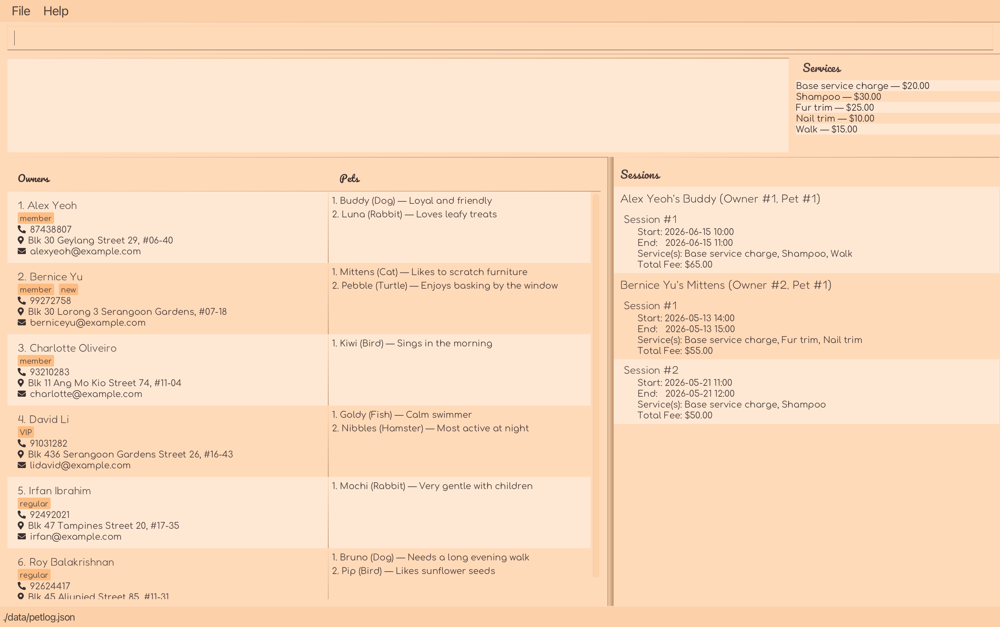

**PetLog** is a desktop application built for **independent pet day care and boarding managers** who juggle many
**owners** and **pets** every day, and need to access information **fast**.

Organise **owner contacts** and keep every **pets’ essential details** in one place. With a **keyboard-driven,
typing-first workflow**, PetLog helps you pull up the right record in seconds.

* If you are interested in using PetLog,
  head over to the [_Quick Start_ section of the **User Guide**](UserGuide.html#quick-start).
* If you are interested about developing PetLog,
  the [**Developer Guide**](DeveloperGuide.html) is a good place to start.

**Acknowledgements**

* Libraries used: [JavaFX](https://openjfx.io/), [Jackson](https://github.com/FasterXML/jackson), [JUnit5](https://github.com/junit-team/junit5)
